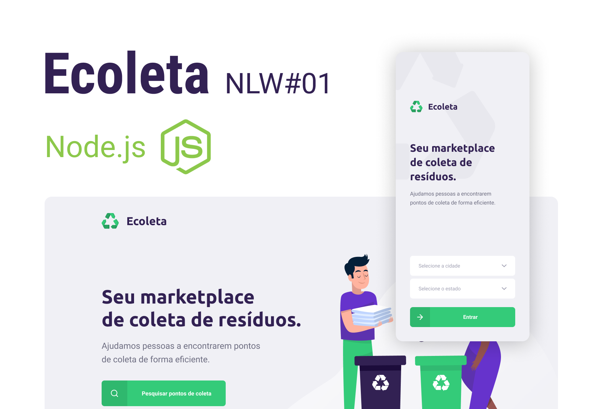

<h1 align="center">
    
</h1>

  <a href="#-tecnologias">Tecnologias</a>&nbsp;&nbsp;&nbsp;|&nbsp;&nbsp;&nbsp;
  <a href="#-projeto">Projeto</a>&nbsp;&nbsp;&nbsp;|&nbsp;&nbsp;&nbsp;
  <a href="#-licença">Licença</a>

  
  
  
  
  
  

  

   

## 🚀 Tecnologias

Esse projeto foi desenvolvido com as seguintes tecnologias:

- [Node.js](https://nodejs.org/en/)
- [React](https://reactjs.org)
- [React Native](https://facebook.github.io/react-native/)
- [Expo](https://expo.io/)

## 💻 Projeto

O Ecoleta é um marketplace que ajuda pessoas a encontrarem pontos de coleta de resíduos de forma eficiente.

Esse respositório diz respeito ao back-end do Ecoleta, mas você encontra os respositórios resferentes às outras partes do projeto nos links abaixo:

- [Ecoleta Web - ReactJS](https://github.com/laurielmesquita/ecoleta-web)
- [Ecoleta Mobile - React Native](https://github.com/laurielmesquita/ecoleta-mobile)

## 📝 Licença

Esse projeto está sob a licença MIT. Veja o arquivo [LICENSE](https://github.com/Rocketseat/nlw-01-booster/blob/master/LICENSE.md) para mais detalhes.

---
 

